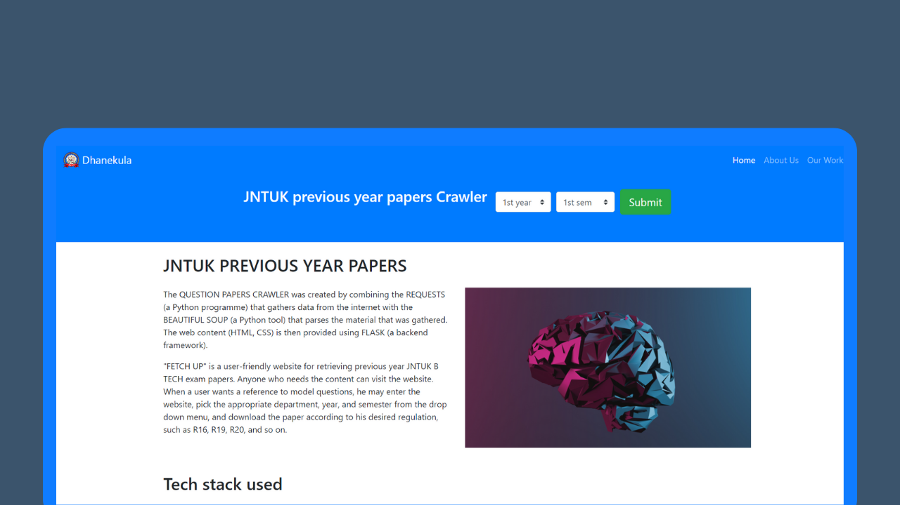

# DIET-INTERNAL-HACKATHON
JNTUK PREVIOUS YEAR QUESTION PAPERS SCRAPPER

## Overview
The Question Papers Crawler is a project developed for the hackathon at our college. It combines the power of Python libraries such as Requests, Beautiful Soup, and Flask to gather data from the internet, parse the gathered material, and provide a web interface to access the question papers' content.

## Features
- Web crawling: The project utilizes the Requests library to crawl websites and retrieve HTML content.
- HTML parsing: Beautiful Soup is used to parse the HTML content and extract relevant information, such as question papers.
- Backend framework: Flask is employed as the backend framework to serve the parsed content and provide a user-friendly interface.

## Tech Stack
The Question Papers Crawler project utilizes the following technologies:

| Technology          | Description                                             |
|---------------------|---------------------------------------------------------|
| Flask               | Backend framework for serving the parsed content         |
| Python Requests     | Library for web crawling and retrieving HTML content     |
| Python Beautiful Soup | HTML parsing library for extracting relevant information |
| HTML                | Markup language for structuring the web content         |
| CSS                 | Stylesheet language for styling the web application     |
| JavaScript          | Programming language for dynamic functionality          |
| Bootstrap           | CSS framework for responsive and mobile-first designs    |

## Demo
To demonstrate the usage of the Question Papers Crawler, here is a sample scenario:

On the homepage, enter the desired website URL or select from a list of predefined options.
Click the "Crawl" button to initiate the web crawling process.
The application will retrieve the HTML content and parse it using Beautiful Soup.
Once the parsing is complete, the question papers or relevant content will be displayed.
Click on a specific question paper to view it in detail or download it.
